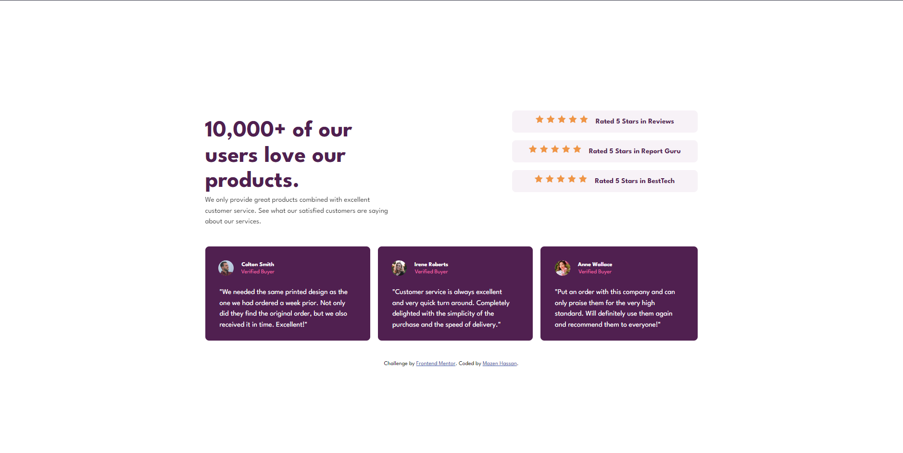

# Frontend Mentor - Social proof section solution

This is a solution to the [Social proof section challenge on Frontend Mentor](https://www.frontendmentor.io/challenges/social-proof-section-6e0qTv_bA). Frontend Mentor challenges help you improve your coding skills by building realistic projects. 

## Table of contents

- [Frontend Mentor - Social proof section solution](#frontend-mentor---social-proof-section-solution)
  - [Table of contents](#table-of-contents)
    - [The challenge](#the-challenge)
    - [Screenshot](#screenshot)
    - [Links](#links)
    - [Built with](#built-with)
    - [What I learned](#what-i-learned)
    - [Continued development](#continued-development)
  - [Acknowledgments](#acknowledgments)

### The challenge

Users should be able to:

- View the optimal layout for the section depending on their device's screen size

### Screenshot

### Links

- Solution URL: [Add solution URL here](https://www.frontendmentor.io/solutions/responsive-combination-of-flexbox-and-grid-challenge-qljyOfQSUb)
- Live Site URL: [Add live site URL here](https://social-proof-section-gules-mu.vercel.app/)

### Built with

- Semantic HTML5 markup
- CSS custom properties
- Flexbox
- CSS Grid
- Mobile-first workflow
- [Styled Components](https://sass-lang.com/) - For styles

### What I learned
In this project, I learned how to further combine Flex and Grid together and take advantage of both. I used Grid on the content inside of card items and played with align-items and margin to get the desired look. One more thing I learned is not to use excessive padding and margins, so I tried to refactor my code and make use of less of them.

### Continued development
I want to continue mixing flex and grid techniques and try discovering quicker and more efficient codes to lay down the design better and easier.

## Acknowledgments

This challenge was not as easy as others, I got a great assist from community mentors, learning one thing or two everytime. Thanks for the valuable tips and advice.
